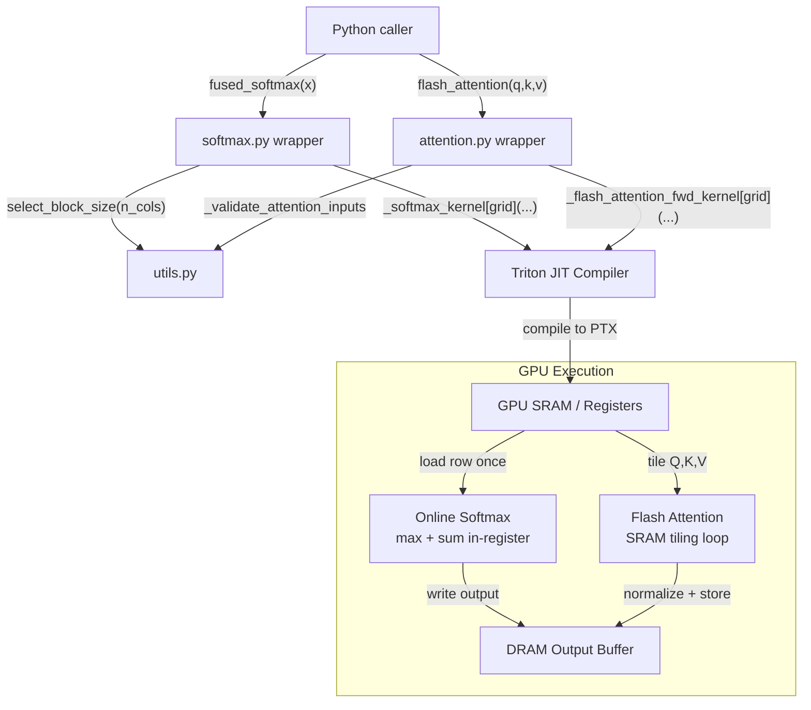

# Architecture: triton-inference-kernels

## System Overview



## Component Responsibilities

| File | Role |
|------|------|
| `softmax.py` | Triton kernel + Python wrapper for fused softmax |
| `attention.py` | Triton kernel + Python wrapper for flash attention |
| `utils.py` | Tile sizing, naive baselines for correctness testing |
| `cli.py` | CLI interface for running benchmarks from the command line |

## Key Abstractions

### `fused_softmax` (softmax.py)

```
Input tensor (n_rows × n_cols)
  │
  ├── select_block_size(n_cols) → BLOCK_SIZE (power-of-2)
  │
  ├── flatten to 2D
  │
  └── Triton kernel [grid = (n_rows,)]
        Each program handles 1 row:
          1. load row into registers (one vectorized load)
          2. compute max in-register (tl.max)
          3. compute exp(row - max) in-register
          4. compute sum in-register (tl.sum)
          5. divide, store output
```

**Why this is faster than PyTorch:**
PyTorch's `F.softmax` reads the input twice (once for max/sum, once for normalization). The Triton kernel loads the row into registers once and performs all operations in-register before writing back. For memory-bound workloads on A100 (2 TB/s DRAM), halving memory reads roughly doubles throughput.

### `flash_attention` (attention.py)

```
Q, K, V tensors (batch × heads × seq_len × head_dim)
  │
  └── Triton kernel [grid = (num_q_tiles, batch × heads)]
        Outer loop: for each query tile (BLOCK_M rows of Q):
          Load Q tile → stays in SRAM
          Inner loop: for each K,V tile (BLOCK_N keys):
            Load K tile, V tile from DRAM
            Compute QK^T tile (BLOCK_M × BLOCK_N)
            Online softmax update:
              m_new = max(m_old, tile_max)
              rescale acc by exp(m_old - m_new)
              acc += exp(QK^T_tile - m_new) @ V_tile
          Normalize: output = acc / l
          Write output tile to DRAM
```

**Why this is memory-efficient:**
Naive attention materializes the full `(seq_len × seq_len)` attention matrix in DRAM. For seq_len=2048 with fp32, this is `2048^2 × 4 = 16 MB per head`. With 32 heads and batch=8, that's 4 GB just for attention weights.

Flash attention's SRAM footprint is `O(BLOCK_M × BLOCK_DHEAD + BLOCK_N × BLOCK_DHEAD + BLOCK_M × BLOCK_N)` — constant with respect to seq_len.

## GPU Memory Hierarchy

```
Register file: ~64 KB/SM, <1 cycle latency
SRAM (shared memory): ~192 KB/SM, ~20 cycle latency
L2 cache: 40 MB (A100), ~200 cycle latency
DRAM (HBM2e): 80 GB (A100), ~800 cycle latency, 2 TB/s bandwidth
```

Triton kernels explicitly control SRAM vs DRAM usage through tiling. The key insight: SRAM bandwidth is ~40× faster than DRAM bandwidth. Any computation that stays in SRAM (registers + shared memory) is "free" compared to the cost of reading from DRAM.

## Tile Size Selection

`utils.select_block_size()` picks the smallest power-of-two >= n_cols, clamped to [32, 4096]. This ensures:
1. Aligned memory access (vectorized 128-byte loads)
2. Full utilization of vector registers
3. Bounded SRAM usage even for wide rows

For the flash attention kernel, `BLOCK_M=64, BLOCK_N=64` are hardcoded defaults tuned for A100. These can be passed as arguments for other hardware targets.
